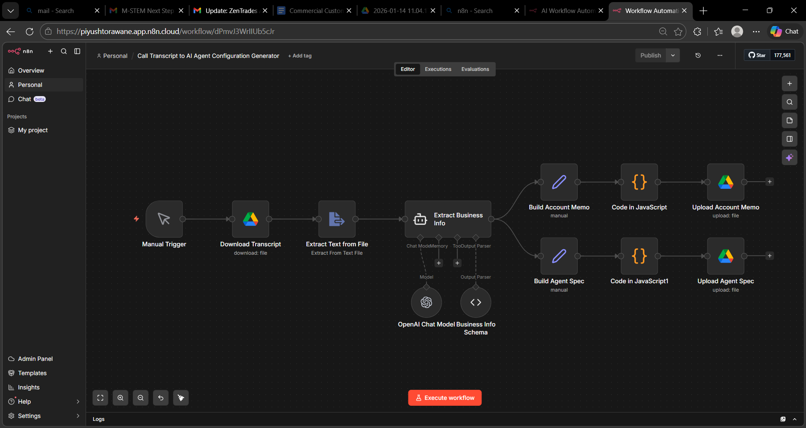
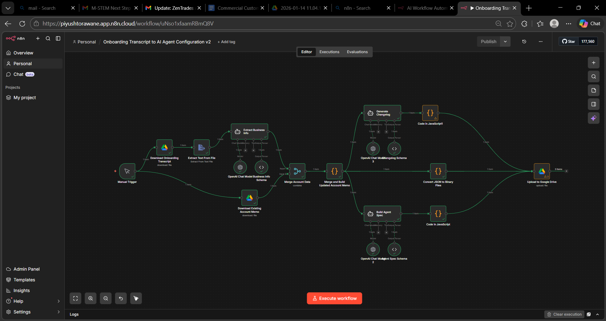

# 🚀 Clara AI Agent Configuration Pipeline

> Automated pipeline that converts call transcripts into structured AI agent configurations with **versioned outputs and change tracking**.

---

# 🧭 System Architecture

The pipeline processes demo and onboarding call transcripts to generate and update AI agent configurations.

---

# 🧠 System Overview

This project implements a small **configuration management pipeline for AI agents**.

The system:

- Converts **unstructured call transcripts → structured agent configuration**
- Maintains **versioned outputs (v1 → v2)**
- Automatically **detects and records changes**
- Generates structured **JSON configuration files**
- Requires **minimal manual intervention**

Two workflows are implemented.

---

# 🧩 Workflow 1 — Demo → Agent Configuration v1

This workflow generates the **initial AI agent configuration** from demo transcripts.

### Steps

1. Download demo transcript
2. Extract text from transcript
3. Extract business information using AI
4. Generate **Account Memo**
5. Generate **Agent Specification**
6. Store outputs as **Version v1**

### Output Location

outputs/accounts/account_001/v1/

### Files Generated

account_memo.json  
agent_spec.json  

---

# 🔄 Workflow 2 — Onboarding → Agent Configuration v2

This workflow updates the existing configuration using onboarding transcripts.

### Steps

1. Download onboarding transcript
2. Extract updated business information
3. Load existing **account memo**
4. Merge updates with existing configuration
5. Generate updated **account memo**
6. Generate updated **agent specification**
7. Generate **changelog**
8. Store outputs as **Version v2**

### Output Location

outputs/accounts/account_001/v2/

### Files Generated

account_memo.json  
agent_spec.json  
changelog.json  

---

# 📊 Versioned Outputs

### Version 1

account_memo.json  
agent_spec.json  

### Version 2

account_memo.json  
agent_spec.json  
changelog.json  

The **changelog** records configuration updates such as:

- New services added
- Updated business hours
- Updated emergency routing rules

---

# 📂 Repository Structure

clara-agent-pipeline

workflows/  
&nbsp;&nbsp;&nbsp;&nbsp;demo_to_agent_v1.json  
&nbsp;&nbsp;&nbsp;&nbsp;onboarding_to_agent_v2.json  
&nbsp;&nbsp;&nbsp;&nbsp;demo_to_agent_v1.png  
&nbsp;&nbsp;&nbsp;&nbsp;onboarding_to_agent_v2.png  

dataset/  
&nbsp;&nbsp;&nbsp;&nbsp;demo/  
&nbsp;&nbsp;&nbsp;&nbsp;&nbsp;&nbsp;&nbsp;&nbsp;demo1.txt  

&nbsp;&nbsp;&nbsp;&nbsp;onboarding/  
&nbsp;&nbsp;&nbsp;&nbsp;&nbsp;&nbsp;&nbsp;&nbsp;onboarding1.txt  

outputs/  
&nbsp;&nbsp;&nbsp;&nbsp;accounts/  
&nbsp;&nbsp;&nbsp;&nbsp;&nbsp;&nbsp;&nbsp;&nbsp;account_001/  

&nbsp;&nbsp;&nbsp;&nbsp;&nbsp;&nbsp;&nbsp;&nbsp;&nbsp;&nbsp;&nbsp;&nbsp;v1/  
&nbsp;&nbsp;&nbsp;&nbsp;&nbsp;&nbsp;&nbsp;&nbsp;&nbsp;&nbsp;&nbsp;&nbsp;&nbsp;&nbsp;&nbsp;&nbsp;account_memo.json  
&nbsp;&nbsp;&nbsp;&nbsp;&nbsp;&nbsp;&nbsp;&nbsp;&nbsp;&nbsp;&nbsp;&nbsp;&nbsp;&nbsp;&nbsp;&nbsp;agent_spec.json  

&nbsp;&nbsp;&nbsp;&nbsp;&nbsp;&nbsp;&nbsp;&nbsp;&nbsp;&nbsp;&nbsp;&nbsp;v2/  
&nbsp;&nbsp;&nbsp;&nbsp;&nbsp;&nbsp;&nbsp;&nbsp;&nbsp;&nbsp;&nbsp;&nbsp;&nbsp;&nbsp;&nbsp;&nbsp;account_memo.json  
&nbsp;&nbsp;&nbsp;&nbsp;&nbsp;&nbsp;&nbsp;&nbsp;&nbsp;&nbsp;&nbsp;&nbsp;&nbsp;&nbsp;&nbsp;&nbsp;agent_spec.json  
&nbsp;&nbsp;&nbsp;&nbsp;&nbsp;&nbsp;&nbsp;&nbsp;&nbsp;&nbsp;&nbsp;&nbsp;&nbsp;&nbsp;&nbsp;&nbsp;changelog.json  

changelog/  
&nbsp;&nbsp;&nbsp;&nbsp;changelog.json  

scripts/  

README.md  

---

# ⚙️ Technologies Used

- **n8n** – workflow automation
- **LLM-powered information extraction**
- **JSON schemas for structured outputs**
- **Google Drive integration**

---

# 🎯 Design Goals

This pipeline was designed to:

- Transform **unstructured transcripts → structured agent configurations**
- Maintain **version-controlled agent definitions**
- Automatically track configuration changes
- Support **repeatable onboarding workflows**
- Scale easily to multiple accounts

---

# 💡 Result

The system acts as a **configuration management pipeline for AI agents**, automatically converting operational call transcripts into **structured and versioned AI agent behavior definitions**.
